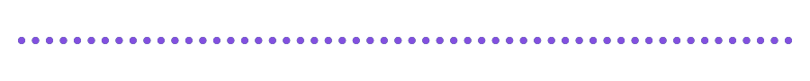

<a href="https://github.com/Dev-2141/Dev-2141">
  <picture>
    <source media="(prefers-color-scheme: dark)" srcset="./generated/neofetch-dark.svg"/>
    <source media="(prefers-color-scheme: light)" srcset="./generated/neofetch-light.svg"/>
    
  </picture>
</a>

<h2 align="center">🚀 Launches</h2>

Every public repo ships with its own launch card — upvotes are ⭐ stars, data refreshes daily.

<!-- LAUNCHES:START -->

<!-- LAUNCHES:END -->

<h2 align="center">🌙 Commit rhythm</h2>

<h2 align="center">🧰 Toolbox</h2>

<h2 align="center">🐍 The snake</h2>

<picture>
  <source media="(prefers-color-scheme: dark)" srcset="https://raw.githubusercontent.com/Dev-2141/Dev-2141/output/snake-dark.svg"/>
  <source media="(prefers-color-scheme: light)" srcset="https://raw.githubusercontent.com/Dev-2141/Dev-2141/output/snake-light.svg"/>
  
</picture>

<i>Hebi means snake. This one eats my contribution graph every day.</i>

